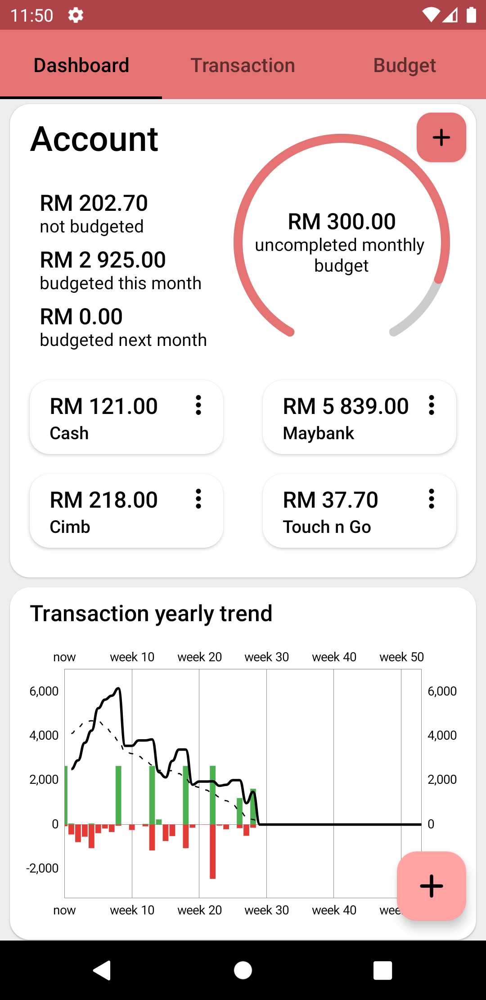
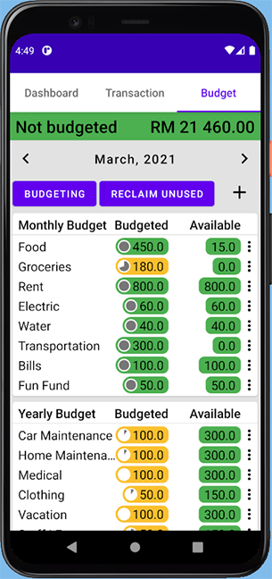

# Mobile Financial Management 2 (MFM)
MFM is Android budgeting application based on the [envelope budgeting method](https://en.wikipedia.org/wiki/Envelope_system). The aim of this app is to make budgeting easy and fast.

[Download Link](https://github.com/kedaitayar/MFM2/releases/download/V1.0.1-beta/app-release.apk)

The plan for this project is to rewrite [MFM v1](https://github.com/kedaitayar/MFM) that will include more technology that is missing from the previous project and overall do a better job at coding and organising the project.

Currently the project has implemented the following:
 - 
 - Hilt (Dependency injection)
 - Navigation Component (Single Activity design)
 - ViewModel (MVVM architecture)
 - LiveData - Flow (Observer pattern - MVVM)
 - Room (Local database)
 - Dao instrument test (Automated testing)
 - ViewBinding
 - Custom view (UI)
 - Material Design (UI and Theme)
 - [MPAndroidChart](https://github.com/PhilJay/MPAndroidChart) (Chart and Graph view)
  
Screentshot
-----------
screenshot of the V1.0.1-beta pre-release  

[Previous version](https://github.com/kedaitayar/MFM)
